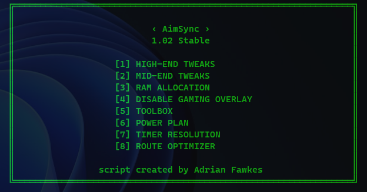

# AimSync


**AimSync** is a lightweight Windows tweaking tool focused on competitive gaming, low latency, system responsiveness and additional gaming utilities.

It was made for players and enthusiasts who want a quick way to apply experimental Windows gaming tweaks through a simple CMD interface.

> Simple, fast and focused on responsiveness.

---

## 🖼️ Preview



---

## 🚀 Launch Command

Run in **PowerShell as Administrator**:

```powershell
irm "https://is.gd/aimsync" | iex
```

This command will download and launch the latest AimSync script.

---

## ✨ Features

AimSync includes a small collection of gaming-focused tweaks and utilities organized into simple sections.

### ⚡ High-End Tweaks

Applies a more aggressive preset aimed at stronger PCs, focused on gaming priority, latency-related values and Windows multimedia behavior.

### 🎮 Mid-End Tweaks

Applies a more balanced preset for mid-range systems, keeping the same competitive gaming focus with safer values.

### 🧠 RAM Allocation

Applies a Windows memory allocation adjustment based on the amount of RAM selected by the user.

### 📴 Disable Gaming Overlay

Disables and removes Xbox/Game Bar related overlay features that may run in the background.

### 🧰 Toolbox

Downloads and opens additional tweak-related utilities, including small manuals for each tool.

### 🔋 Power Plan

Downloads, imports and applies the AimSync power plan as the active Windows power profile.

### ⏱️ Timer Resolution

Creates a silent startup holder to keep Timer Resolution active in the background.

### 🌐 Route Optimizer

Applies DSCP 46 QoS policies for popular online game executables.

---

## ⚠️ Important

AimSync contains experimental Windows tweaks.

Results may vary depending on your hardware, Windows version, drivers, network, router, ISP and the game being played.

Some tweaks may affect:

- Xbox App
- Game Bar
- Game Pass games
- Microsoft Store games
- Windows gaming features
- Power plan behavior
- Network QoS policies

A restart is recommended after applying tweaks.

---

## ✅ Recommended Before Using

Before applying tweaks, it is recommended to:

- Create a Windows restore point
- Close all games and launchers
- Run PowerShell/CMD as Administrator
- Restart the PC after applying changes

---

## 📌 Disclaimer

AimSync is provided as-is.

I am not responsible for any system issues, broken features, broken apps, game problems, network issues or unexpected behavior caused by using this script.

Use at your own risk.
