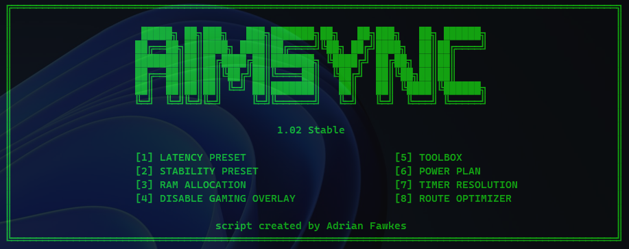

# AimSync


**AimSync** is a lightweight Windows tweaking tool focused on competitive gaming, low latency and overall system responsiveness.

Made for players and enthusiasts who want quick experimental tweaks through a simple CMD interface.

---



## 🚀 Launch

Run in **PowerShell as Administrator**:

```powershell
irm "https://is.gd/aimsync" | iex
```

---

## Features

- **High-End Tweaks** — aggressive gaming-focused preset for stronger PCs.
- **Mid-End Tweaks** — balanced preset for mid-range systems.
- **RAM Allocation** — applies a basic Windows memory allocation adjustment.
- **Disable Gaming Overlay** — disables/removes Xbox and Game Bar related features.
- **Toolbox** — downloads extra tweak utilities with quick manuals.
- **Power Plan** — imports and activates the AimSync power plan.
- **Timer Resolution** — creates a silent startup holder for timer resolution.
- **Route Optimizer** — applies DSCP 46 QoS policies for online games.

---

## Notes

AimSync uses experimental Windows tweaks. Results may vary depending on your hardware, Windows version, drivers, network and games.

A restart is recommended after applying tweaks.

---

## Disclaimer

Use at your own risk.  
Create a restore point before applying changes.
